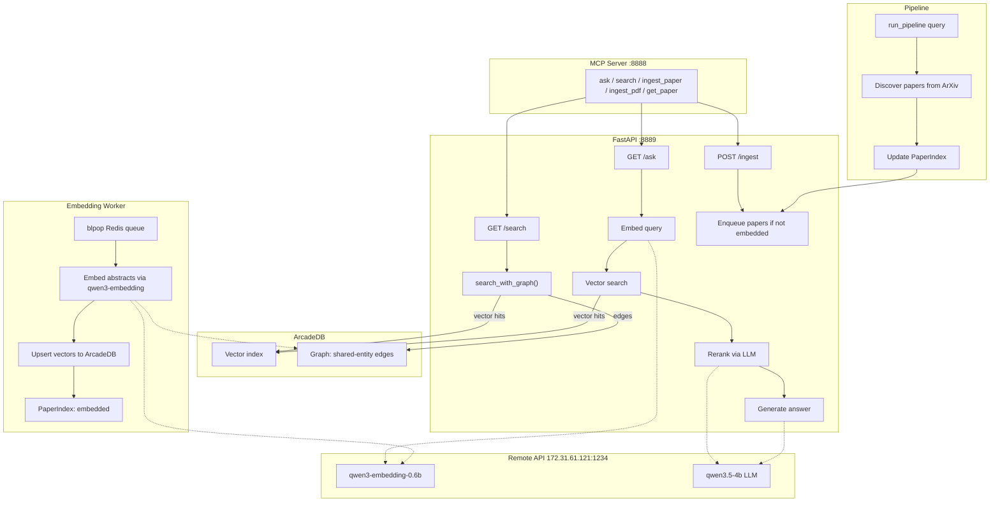

# Litgraph

> 🚧 Under construction

Graph-augmented semantic search for academic literature

## Features

- 📄 Ingest papers: ArXiv pipeline, direct API (`POST /api/ingest`), PDF upload (`POST /api/ingest/upload`), or PDF by URL/file via MCP
- 🧠 Queue papers for embedding (deferred, async, deduplicated via Redis)
- 🧮 Track paper ingestion state in SQLite-backed index
- 📦 Index embeddings into ArcadeDB (vector + graph in one DB)
- 🔍 Semantic search with graph enrichment (shared-entity edges between papers)
- 🤖 LLM-powered RAG answers (qwen3.5-4b, remote API) with candidate reranking by the same service LLM
- 🔌 MCP server for AI agent integration (streamable-http)
- ✅ Type-safe, testable, modular pipeline
- ⚙️ Health checks, typed interfaces, and task runner setup

## Models

All heavy models are served by a remote OpenAI-compatible API (`llama-server` / LM Studio on `172.31.61.121:1234`); the API/worker containers run on CPU:

| Model | Purpose | Size | Where |
|-------|---------|------|-------|
| text-embedding-qwen3-embedding-0.6b | Text embeddings (1024-dim, 32k ctx) | 0.6B | Remote API (`172.31.61.121:1234`) |
| qwen3.5-4b@q4_k_xl | RAG answers + candidate reranking (JSON ordering) | 4B | Remote API (`172.31.61.121:1234`) |

Local fallbacks exist (`EMBEDDING_MODEL_PATH` → SentenceTransformer, `LLM_MODEL_PATH` → transformers) but are not used by default. The previous Jina Reranker V3 cross-encoder was removed from the stack; reranking is done by the service LLM.

## Usage

### Requirements

- Python 3.12+
- Docker + Docker Compose
- A running embedding/LLM endpoint (LM Studio or llama-server); GPU lives there, not in this repo's containers

### Local dev (CPU by default)

```bash
make up-full-dev        # Full stack with CPU
USE_GPU=1 make rebuild  # With GPU (requires NVIDIA runtime)
```

Services:

- **API** → [http://localhost:8889/docs](http://localhost:8889/docs)
- **MCP Server** → [http://localhost:8888/mcp](http://localhost:8888/mcp) (streamable-http)
- **Frontend (dev)** → [http://localhost:5173](http://localhost:5173)
- **Redis** → localhost:6379 (use `redis-cli`)
- **ArcadeDB console** → http://localhost:2480

### Direct tasks (no Docker)

```bash
cd backend
uv run poe server     # Start FastAPI backend
uv run poe mcp        # Start MCP server
uv run poe pipeline   # End-to-end pipeline
uv run poe test       # Run tests
```

### Environment

```env
REDIS_URL=redis://localhost:6379/0

EMBEDDING_API_URL=http://172.31.61.121:1234/v1
EMBEDDING_MODEL=text-embedding-qwen3-embedding-0.6b
EMBEDDING_DIM=1024

LLM_API_URL=http://172.31.61.121:1234/v1
LLM_MODEL=qwen3.5-4b@q4_k_xl

LITGRAPH_CACHE=~/.cache/litgraph/paper_index.db
ARCADEDB_URI=bolt://localhost:7687
ARCADEDB_DATABASE=litrag
MCP_PORT=8888
```

Embeddings + LLM served by the remote API. Switch to local: comment `*_API_URL`/`*_MODEL`, uncomment `*_MODEL_PATH` (see `.env.example`).

## Diagram

<details>
<summary>System architecture diagram</summary>



</details>

Stack highlights:

- Backend: FastAPI + Pydantic + uv
- LLM: llama-server remote API (qwen3.5-4b@q4_k_xl) — generation and reranking
- Embeddings: Remote API (`text-embedding-qwen3-embedding-0.6b` via llama-server)
- MCP: mcp SDK 2.0.0 (MCPServer, streamable-http)
- Queue: Redis (Upstash HTTP or redis-py)
- Vector DB + Graph: ArcadeDB
- Frontend: React + Vite + Tailwind
- Infra: Docker Compose

## Acknowledgements

Thank you to arXiv for use of its open access interoperability.

## License

MIT
