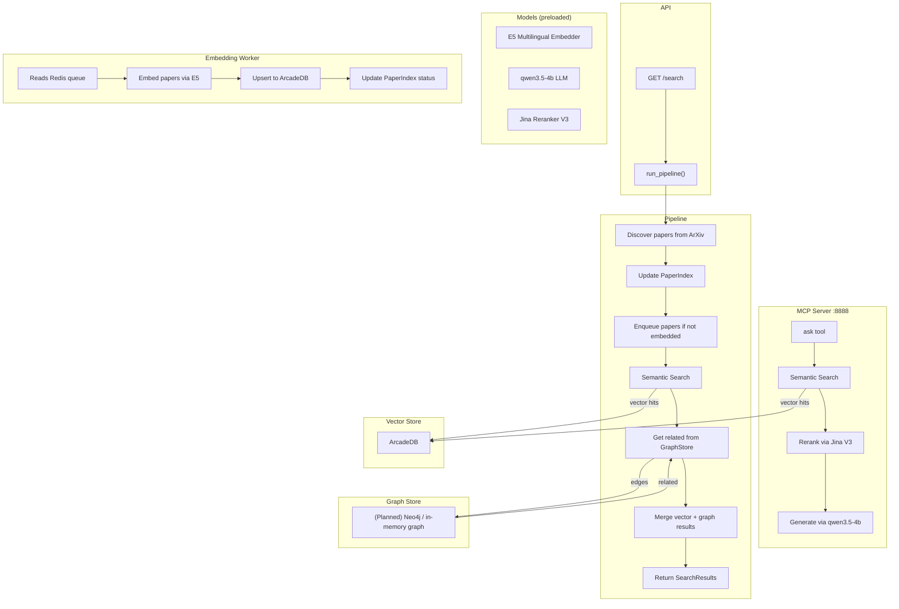

# Litgraph

> 🚧 Under construction

Graph-augmented semantic search for academic literature

## Features

- 📄 Fetch papers from ArXiv API
- 🧠 Queue papers for embedding (deferred, async)
- 🧮 Track paper ingestion state in SQLite index
- 📦 Index embeddings into ArcadeDB
- 🔍 Search ArcadeDB with E5 embeddings
- 🤖 LLM-powered RAG answers (qwen3.5-4b, remote API)
- 🎯 Cross-encoder reranking (Jina Reranker V3)
- 🔌 MCP server for AI agent integration (Claude Desktop, etc.)
- 🧩 Merge vector + (planned) graph hits
- ✅ Type-safe, testable, modular pipeline
- ⚙️ Health checks, typed interfaces, and task runner setup
- ⚡ Models preloaded at startup for instant response

## Models

Only reranker loaded at server startup (embeddings + LLM via remote API):

| Model | Purpose | Size | Where |
|-------|---------|------|-------|
| text-embedding-multilingual-e5-large-instruct | Text embeddings (1024-dim) | ~560M | Remote API (`172.31.61.121:1234`) |
| qwen3.5-4b@q4_k_xl | RAG answer generation | 4B | Remote API (`172.31.61.121:1234`) |
| Jina Reranker V3 | Cross-encoder reranking | 0.6B | Local filesystem |

## Usage

### Requirements

- Python 3.12+
- Node.js 20+
- Docker + Docker Compose
- NVIDIA GPU (CUDA) for LLM/reranker

### Local dev (CPU by default)

```bash
make up-full        # Run full stack with CPU
make up-full USE_GPU=1  # Run with GPU (requires NVIDIA runtime)
```

Services:

- **API** → [http://localhost:8889/docs](http://localhost:8889/docs)
- **MCP Server** → [http://localhost:8888/mcp](http://localhost:8888/mcp) (streamable-http)
- **Redis** → localhost:6379 (use `redis-cli`)

### Direct tasks (no Docker)

```bash
# Start FastAPI backend
cd backend && python -m uvicorn src.server:app --host 0.0.0.0 --port 8889

# Start MCP server
cd backend && python -m src.mcp_server

# Run end-to-end pipeline
poe pipeline

# Run tests
poe test
```

### Environment

```env
REDIS_URL=redis://localhost:6379/0
EMBEDDING_API_URL=http://172.31.61.121:1234/v1
EMBEDDING_MODEL=text-embedding-multilingual-e5-large-instruct
EMBEDDING_DIM=1024
LLM_API_URL=http://172.31.61.121:1234/v1
LLM_MODEL=qwen3.5-4b@q4_k_xl
RERANKER_MODEL_PATH=/path/to/jina-reranker-v3
MCP_PORT=8888
```

Embeddings + LLM served by remote API (`llama-server` / LM Studio on `172.31.61.121:1234`).
Switch to local: comment `*_API_URL`/`*_MODEL`, uncomment `*_MODEL_PATH`.

## Diagram

<details>
<summary>System architecture diagram</summary>



</details>

Stack highlights:

- Backend: FastAPI + Pydantic + uv
- LLM: llama-server remote API (qwen3.5-4b@q4_k_xl)
- Reranker: HuggingFace Transformers (Jina Reranker V3, local)
- Embeddings: Remote API (`text-embedding-multilingual-e5-large-instruct` via llama-server)
- MCP: FastMCP (streamable-http)
- Queue: Redis (Upstash or local)
- Vector DB: ArcadeDB
- Frontend: React + Vite + Tailwind
- Infra: Docker Compose

## Acknowledgements

Thank you to arXiv for use of its open access interoperability.

## License

MIT
